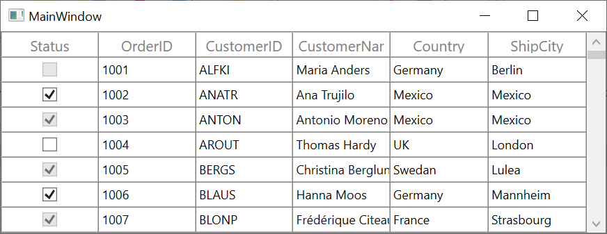

# how-to-conditionally-enabled-or-disable-check-box-in-wpf-data-grid-Column
How to conditionally enabled or disable CheckBox in WPF DataGrid (SfDataGrid) Column?

By default, the CheckBox check state will be updated based on the content for that specified cell. To update check state based on other column value in the same record, IValueConverter can be implemented and the Convert() method can be implemented to have your own condition.

```C#
public class ChangeState : IValueConverter
{
    public object Convert(object value, Type targetType, object parameter, System.Globalization.CultureInfo culture)
    {
        var data = value as OrderInfo;
        if ((data.OrderID % 2) == 0) //To add your own condition
            return true;

        return false;
    }
}
```
To bind the converter for GridCells.
```xaml
<Window.Resources>
    <local:ChangeState x:Key="converter" />
    <Style x:Key="cellStyle" TargetType="syncfusion:GridCell">
        <Setter Property="IsEnabled" Value="{Binding Converter={StaticResource converter}}" />
    </Style>
</Window.Resources>

<syncfusion:GridCheckBoxColumn CellStyle="{StaticResource cellStyle}" MappingName="Status" />
```

